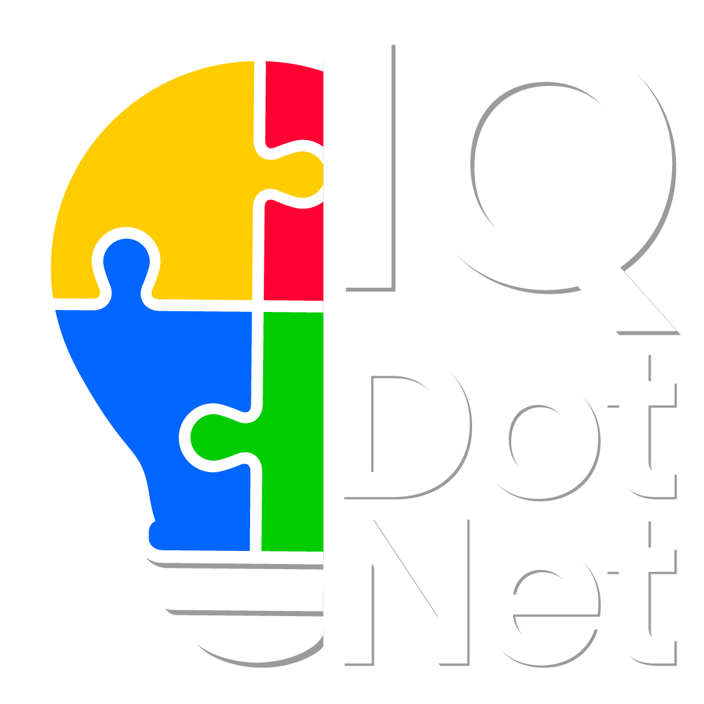

# IQDOTNET · Landing

**Sitio oficial de presentación de IQDOTNET** — *Ingeniería, Software e Innovación Inteligente.*

---

## 🌐 Sitio en vivo

👉 **https://portafolio.iqdotnet.net**

Landing estática que presenta los servicios y soluciones de IQDOTNET: desarrollo de software a la medida, automatización de procesos, bases de datos, integraciones y más.

## ✨ Características

- Diseño responsive (móvil / escritorio) con tema oscuro de marca.
- Logo animado, secciones con animación de aparición y botón flotante de WhatsApp.
- Vista previa enriquecida al compartir el enlace (Open Graph / Twitter Card).
- Servido gratis con **GitHub Pages** + dominio propio verificado + HTTPS.

## 🛠️ Construido con

`HTML5` · `CSS3` · `JavaScript` · `GitHub Pages`

## 📬 Contacto

- 🌐 Web: [iqdotnet.net](https://www.iqdotnet.net/)
- 💬 WhatsApp: [+52 55 4020 8216](https://wa.me/525540208216)
- ✉️ Email: [nguajardo@iqdotnet.net](mailto:nguajardo@iqdotnet.net)

© IQDOTNET · México

